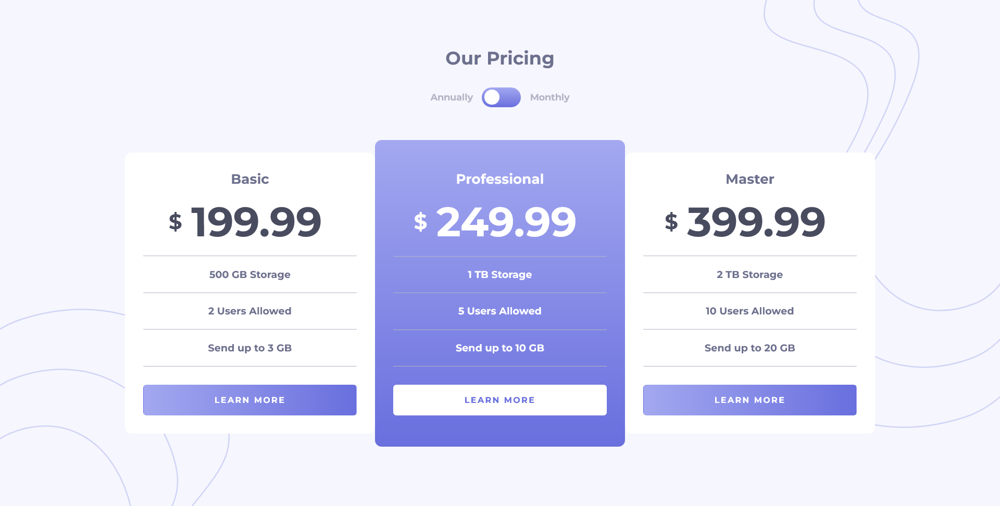

# Frontend Mentor - Pricing component with toggle solution

This is a solution to the [Pricing component with toggle challenge on Frontend Mentor](https://www.frontendmentor.io/challenges/pricing-component-with-toggle-8vPwRMIC). Frontend Mentor challenges help you improve your coding skills by building realistic projects. 

### The challenge

Users should be able to:

- View the optimal layout for the component depending on their device's screen size
- Control the toggle with both their mouse/trackpad and their keyboard
- **Bonus**: Complete the challenge with just HTML and CSS

### Links

-  [Solution](https://www.frontendmentor.io/solutions/pricing-component-with-toggle-ADJLpnvhWU)
-  [Live Site](https://lspacka.github.io/FEM-pricing-component-with-toggle/)

### Built with

- HTML
- CSS
- JavaScript

## Author

- [Frontend Mentor](https://www.frontendmentor.io/profile/lspacka)
- [Twitter](https://www.twitter.com/lspacka)
